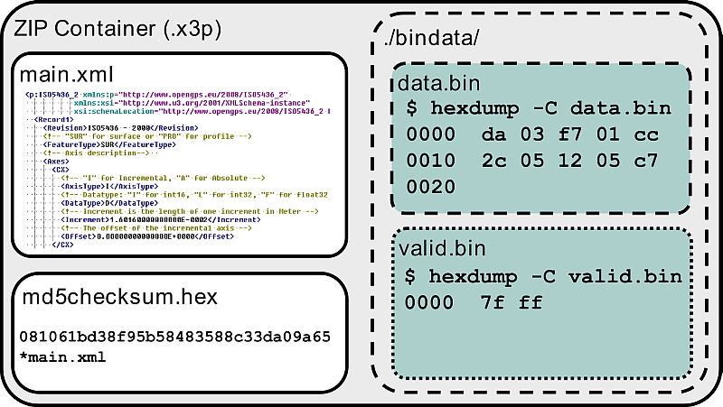

# X3P #
## An X3P implementation following the XSD schema of OpenGPS and ISO5436-2 ##

### What has been done ###

This repository is an example of a practical implementation of the X3P format
following the ISO5436-2.xsd schema available at: 
https://sourceforge.net/p/open-gps/code/HEAD/tree/ISO5436_XML/branches/Kohler_LinuxPort/src/ISO5436_2_XML/iso5436_2.xsd

The core library to create X3P is the is C# class iso5436_2.cs which was automatically generated with the xsd.exe tool from the xsd schema mentioned above.

Patches, pull requests, etc to improve this code are appreciated.

### What X3P is and how it is structured ###
 
 "x3p is a file format for 2D and 3D profile data. The file extension x3p can be memorized as XML 3-D Surface Profile. It is a container format conforming to the ISO5436-2 standard. It has been implemented to provide a simple and standard conforming way to exchange profile data. Due to its flexibility it can be used for point clouds without any topology as well as for projectable 2½D profile data and for multilayer profiles. 

#### Internal Structure ####

The container’s directory structure consists of a central document named “main.xml”. The main document is an XML-file as defined in [Iso5436_2.xsd]. For a simple document the container comprises only “main.xml” and the checksum file “md5checksum.hex”. More complex documents, with larger amounts of data, can store the actual measurement data in a binary file. A link in “main.xml” points to the binary file. Binary files are stored in a subdirectory named “bindata”. The name of the binary file can be chosen freely. A recommended name is “data.bin”. The relative URI pointing to the binary file would in the default case look like “bindata/data.bin”.

To mark valid and invalid points in a binary file an optional matrix with the recommended name “bindata/valid.bin” can be stored. This file contains a packed array of Boolean values (a bit field). The value True (bit value 1) is associated with a valid point.

If the validity file does not exist all points are valid that do not have the special floating point value NaN (Not a Number).

#### Format of Binary Files ####
The binary file is a plain matrix of data points, written in binary format. The matrix has three dimensions. Each data point contains one ore more coordinates in X,Y,Z sequence and types specified in <DataType> in Record1 in “main.xml”.

#### Matrix Structure ####
The matrix always has three dimensions. By definition the matrix has to resemble the topological neighbourhood of the data points in the 3D-space. Clearly said two points that are neighbours in 3D have to be placed in neighbouring cells of the matrix grid.

#### Matrix indexing ####
The three dimensions of the matrix correspond to the three coordinate axes of the measured profile data. The first dimension corresponds to the x-axis, the second to the y-axis, and the third to the z-axis. The x-index is the fastest index y the next slower and z the slowest index. For a matrix of x-y-z-dimensions <Matrix>3;3;2</Matrix> the cell order of the points P(x,y,z) looks like the following example:

P(1,1,1), P(2,1,1), P(3,1,1),
P(1,2,1), P(2,2,1), P(3,2,1),
P(1,3,1), P(2,3,1), P(3,3,1),
P(1,1,2), P(2,1,2), P(3,1,2),
P(1,2,2), P(2,2,2), P(3,2,2),
P(1,3,2), P(2,3,2), P(3,3,2)

The indexing is used for binary files as well as for xml-data in the <DataList> tag. Data Types Possible data types are:

“I”: 16 bit signed integer in Intel byte order that is low byte (LSB) first. 
“L”: 32 bit signed integer in Intel byte order that is LSB, 2nd SB, 3rd SB, MSB. 
“F”: 32 bit IEEE 754 floating point number 
“D”: 64 bit IEEE 754 floating point number

#### Data Order ####
Each cell can contain an X, Y and Z coordinate in this order. The X and Y coordinate are optional for points stored in a <DataMatrix>, depending on the types of axis defined. For an incremental X or Y axis, no X and Y-coordinates are written to the DataMatrix because the X- and Y- indices are defined by the matrix indices of a point."

 See this [link](https://sourceforge.net/p/open-gps/mwiki/X3p/) for more information.

### How to build your own project ###

*1.* Import the iso4536_2.cs into your own project;
*2.* Instantiate a new iso4536_2 object and inizialize all required fields (Note: some fields could require other objects to be instantiated);
*3.* Create a Stream Writer and write to a destination file an XMLScheme object;
*4.* Using the System.Security.Cryptography libraries create the checksums and write them to a .hex file;
*5.* Using the System.IO.Compression libraries create the .x3p archive; 

### Build requirements: ###
 - xsd.exe;
 - Visual Studio 10 or higher;

### References ###
[The OpenFMC repository for C/C++ and other code for reading and writing X3P files.](https://github.com/OpenFMC/x3p)

[Open GPS project](https://sourceforge.net/p/open-gps/mwiki/X3p/)

### Author ###

* `Sandu Alin Cristinel`, University of Verona (Italy) [alincristinel.sandu@gmail.com](mailto:alincristinel.sandu@gmail.com)

### License ###

> GNU GENERAL PUBLIC LICENSE
>
> Copyright (c) 2018 Alin Cristinel Sandu
> 
> Permission is hereby granted, free of charge, to any person obtaining a copy
> of this software and associated documentation files (the "Software"), to deal
> in the Software without restriction, including without limitation the rights
> to use, copy, modify, merge, publish, distribute, sublicense, and/or sell
> copies of the Software, and to permit persons to whom the Software is
> furnished to do so, subject to the following conditions:
> 
> The above copyright notice and this permission notice shall be included in all
> copies or substantial portions of the Software.
> 
> THE SOFTWARE IS PROVIDED "AS IS", WITHOUT WARRANTY OF ANY KIND, EXPRESS OR
> IMPLIED, INCLUDING BUT NOT LIMITED TO THE WARRANTIES OF MERCHANTABILITY,
> FITNESS FOR A PARTICULAR PURPOSE AND NONINFRINGEMENT. IN NO EVENT SHALL THE
> AUTHORS OR COPYRIGHT HOLDERS BE LIABLE FOR ANY CLAIM, DAMAGES OR OTHER
> LIABILITY, WHETHER IN AN ACTION OF CONTRACT, TORT OR OTHERWISE, ARISING FROM,
> OUT OF OR IN CONNECTION WITH THE SOFTWARE OR THE USE OR OTHER DEALINGS IN THE
> SOFTWARE.
 

